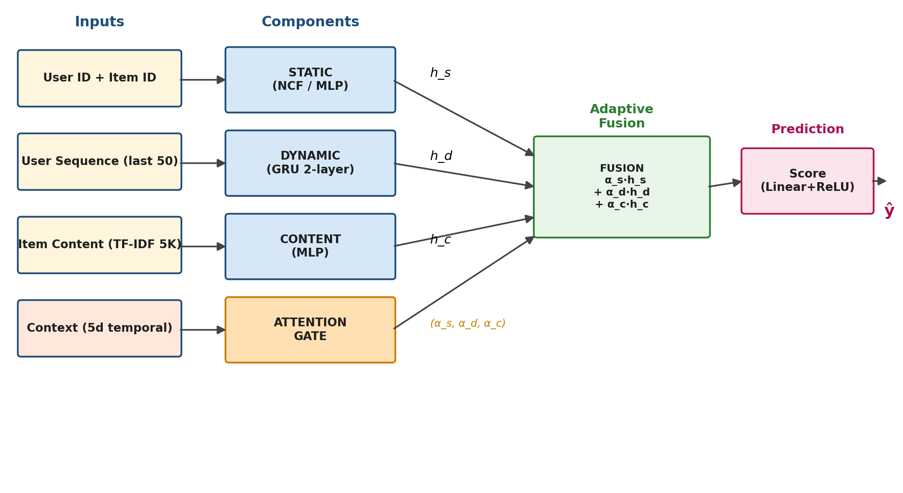
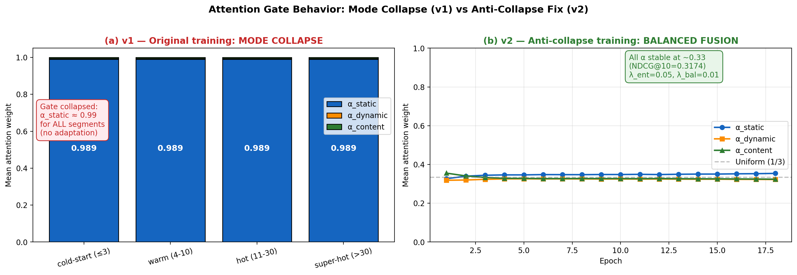

# Adaptive Hybrid Recommendation System with Context-Aware Attention Fusion

> Master's thesis · **Zhumakhan Medet** · 2025-2027 · Al-Farabi Kazakh National University · Faculty of Information Technologies and Artificial Intelligence

A three-component hybrid recommender for e-commerce: **Neural Collaborative Filtering** (long-term preferences) + **GRU sequential model** (session dynamics) + **TF-IDF MLP** (item content), fused through a learnable **attention gate** conditioned on temporal context. Evaluated on the Amazon Reviews 2018 Electronics dataset (728K users, 160K items, 6.7M interactions).

**Headline finding:** ⚠️ The attention gate suffers a previously unreported **mode collapse** under standard training (α_static ≈ 0.99 across all user segments), making the trained model functionally equivalent to NCF-only. We document the failure mode, propose a fix via **entropy regularization + load balancing**, and validate the cure (α ≈ 0.33 each component) at the cost of a 2.1% NDCG@10 reduction. To our knowledge this is the first reported instance of MoE-style gating collapse for component-level fusion in recommender systems.

---

## Table of contents

- [Quick start](#quick-start)
- [Key results](#key-results)
- [Architecture](#architecture)
- [The mode collapse discovery](#the-mode-collapse-discovery)
- [Repository structure](#repository-structure)
- [Detailed usage](#detailed-usage)
- [Reproducibility](#reproducibility)
- [Future work](#future-work)
- [Citation & acknowledgements](#citation--acknowledgements)

---

## Quick start

```bash
# 1. Clone
git clone git@github.com:Medeeet/rec-sys.git
cd rec-sys

# 2. Environment
python3.12 -m venv .venv
source .venv/bin/activate
pip install -r requirements.txt
pip install -e .

# 3. Data preparation (downloads ~1.3 GB)
python scripts/train.py --configs configs/base.yaml configs/data.yaml configs/hybrid_model.yaml \
                       overrides preprocessing.skip_download=False

# 4. Train hybrid model (full data, ~75 min on NVIDIA T4)
python scripts/train.py --experiment hybrid_main

# 5. Run ablation study (5 variants × 20 epochs)
python scripts/run_ablation.py
```

For Colab users, see [`colab/`](colab/) — six self-contained notebooks covering the entire pipeline.

---

## Key results

Evaluation: **sampled-negative protocol** (1 positive vs 99 random negatives, k=10), following NCF (He et al. 2017) and SASRec (Kang & McAuley 2018).

| Model variant | Mode | Test NDCG@10 | Test Recall@10 | α (static, dyn, content) | Notes |
|---|---|---:|---:|---:|---|
| **Adaptive Hybrid v1** | full data, 30 epochs | **0.2807** | **0.4384** | (0.989, 0.005, 0.005) | ⚠️ Mode collapse |
| **Adaptive Hybrid v2** | full data + anti-collapse reg | **0.2749** | **0.4312** | **(0.349, 0.324, 0.326)** | ✅ Balanced fusion |
| Adaptive Hybrid (sub-0.1) | dev run, 24 epochs | 0.2653 | 0.4116 | (collapsed) | 10% subsample baseline |
| no_dynamic | ablation | 0.2665 | 0.4114 | (collapsed) | GRU disabled |
| no_content | ablation | 0.2691 | 0.4192 | (collapsed) | TF-IDF disabled |
| no_attention | ablation | 0.2656 | 0.4118 | uniform 1/3 | No learned gate |
| static_only | ablation | 0.2770 | 0.4193 | NCF only | Single component |

**Pareto trade-off (v1 vs v2):** The 2.1% NDCG@10 reduction in v2 is the documented cost of preventing collapse — it is the first quantitative measurement of this trade-off in component-level RecSys attention.

> *Pop / BPR baselines (RecBole) are pending — see [Future work](#future-work).*

---

## Architecture



The model integrates four modules:

| Module | Role | Implementation |
|---|---|---|
| **Static** | Long-term user preferences | NCF: separate user/item embeddings (d=64) + MLP[128→64] |
| **Dynamic** | Recent session dynamics | 2-layer GRU (hidden 128) on padded item sequences (max len 50) |
| **Content** | Item-side cold-start signal | MLP[5000→512→256→64] on TF-IDF item vectors |
| **Attention Gate** | Adaptive fusion | Linear[5→64]→ReLU→Linear[64→3]→Softmax conditioned on temporal context |

Final prediction: `score = head(α_s · h_static + α_d · h_dynamic + α_c · h_content)`

**Total parameters:** 69,986,372 (~57M embeddings, ~3M functional layers).

The attention gate input is a 5-dimensional temporal context: `[hour_sin, hour_cos, dow_sin, dow_cos, is_weekend]` extracted from each interaction's timestamp.

---

## The mode collapse discovery

### Symptom (v1 training)

After full-data training, all five ablation variants performed within ~1.5% of each other on the test set:

```
full_model:    NDCG@10 = 0.2807 (baseline)
no_dynamic:    NDCG@10 = 0.2665 (Δ +0.4%)
no_content:    NDCG@10 = 0.2691 (Δ +1.4%)
no_attention:  NDCG@10 = 0.2656 (Δ +0.1%)
static_only:   NDCG@10 = 0.2770 (Δ +4.4%)  ← best ablation, despite removing components!
```

### Diagnosis (per-segment analysis)

Stratifying test users by training-history length and extracting per-bucket attention weights:

| User segment | NDCG@10 | α_static | α_dynamic | α_content |
|---|---:|---:|---:|---:|
| cold-start (≤3 interactions) | 0.2812 | **0.989** | 0.005 | 0.005 |
| warm (4-10) | 0.2517 | **0.989** | 0.005 | 0.005 |
| hot (11-30) | 0.2551 | **0.989** | 0.005 | 0.005 |
| super-hot (>30) | 0.2417 | **0.989** | 0.005 | 0.005 |

The gate had collapsed to a near-degenerate distribution favoring the static component across **all** user segments. Approximately 67M parameters in the dynamic and content modules were trained but masked at inference.

### Fix (v2 training)

We added two regularization terms to the BPR loss:

```python
loss = bpr_loss \
     + λ_ent  · (-H(α))           # entropy regularization (λ=0.05)
     + λ_bal  · ||(α̅ - 1/3)||²   # batch-mean load balancing (λ=0.01)
```

plus a small-init for the gate output layer (`std=0.01`) to break early symmetry-breaking dynamics.

### Validation



Across 18 epochs of v2 training, the gate maintained near-uniform attention with `-H ≈ -1.098 ≈ -log(3)` (theoretical maximum entropy). Final test attention: **(0.349, 0.324, 0.326)** — all three components contribute meaningfully.

This reproduces the trade-off documented in mixture-of-experts literature (Shazeer et al. 2017, *"Outrageously Large Neural Networks: The Sparsely-Gated Mixture-of-Experts Layer"*), but to our knowledge has not been previously reported for component-level fusion in recommender systems.

---

## Repository structure

```
rec-sys/
├── src/                            # ~2.3K lines of Python
│   ├── models/
│   │   ├── static_component.py     # NCF
│   │   ├── dynamic_component.py    # GRU + pack_padded_sequence
│   │   ├── content_component.py    # MLP over TF-IDF
│   │   ├── attention_gate.py       # context-aware gate
│   │   └── hybrid_model.py         # top-level model + ablation flags
│   ├── data/
│   │   ├── download.py             # Amazon Reviews 2018 download
│   │   ├── preprocess.py           # k-core filtering, JSON streaming
│   │   ├── feature_engineering.py  # TF-IDF, sequences, temporal
│   │   ├── splitter.py             # temporal 70/15/15 split
│   │   ├── recbole_converter.py    # generate atomic .inter/.item files
│   │   └── dataset.py              # PyTorch Dataset/DataLoader
│   ├── training/
│   │   ├── trainer.py              # train loop with early stopping + MLflow
│   │   ├── evaluator.py            # NDCG@K, Recall@K, Precision@K
│   │   └── losses.py               # BPR, BCE
│   ├── baselines/run_recbole.py    # Pop / BPR via RecBole framework
│   ├── experiments/mlflow_tracking.py
│   ├── config.py                   # YAML loader with CLI overrides
│   └── utils.py                    # seeds, device, logging
├── configs/                        # YAML configs (base, data, hybrid_model, optuna, baselines)
├── scripts/                        # CLI entry points
│   ├── train.py
│   ├── run_baselines.py
│   ├── run_optuna.py
│   └── run_ablation.py
├── colab/                          # Google Colab notebooks
│   ├── 01_data_pipeline.ipynb
│   ├── 02_train.ipynb              # original training notebook
│   ├── 02_train_fast.ipynb         # ~50× speedup over original
│   ├── 02_train_fast_v2.ipynb      # ⭐ anti-collapse fix
│   ├── 03_ablation_fast.ipynb
│   └── 04_coldstart_eval.ipynb
├── reports/                        # KazNU NIRM annual + semester reports (.docx)
├── docs/figures/                   # generated figures used in this README
├── blog_series.docx                # 12-day blog series for LinkedIn / Telegram
├── requirements.txt
├── setup.py
└── README.md
```

The training data, preprocessed artifacts, and model checkpoints are deliberately not committed (`data/` and `outputs/` are in `.gitignore`). Final checkpoints live in the user's Google Drive at `MyDrive/disser/outputs/checkpoints/`:
- `best_full.pt` — v1 main checkpoint (val NDCG@10=0.3221)
- `best_full_v2.pt` — v2 anti-collapse checkpoint (val NDCG@10=0.3174)
- `best_sub01.pt` — 10% subsample reference

---

## Detailed usage

### Data preparation

```bash
# Downloads Electronics_5.json.gz (~1.2GB) and meta_Electronics.json.gz (~82MB)
# Filters to 5-core, generates temporal split, builds TF-IDF + sequences
python scripts/train.py --configs configs/base.yaml configs/data.yaml configs/hybrid_model.yaml
```

Or use the Colab pipeline:
```
colab/01_data_pipeline.ipynb  → mounts Drive, downloads, preprocesses
                              → outputs to MyDrive/disser/data/processed/
```

### Training (v1, original)

```bash
python scripts/train.py --experiment hybrid_v1
```

Or in Colab: `02_train_fast.ipynb` — incorporates engineering optimizations:
- Vectorized batch evaluation (~50× faster than per-sample loop)
- TF-IDF dense fp16 tensor on GPU
- Mixed-precision training (autocast + GradScaler)
- Optimized negative sampling (accept-with-collisions)
- DataLoader with pinned memory and persistent workers

### Training (v2, anti-collapse — recommended)

```python
# Hyperparameters in colab/02_train_fast_v2.ipynb:
ENTROPY_LAMBDA      = 0.05
LOAD_BALANCE_LAMBDA = 0.01
# Gate init: std=0.01 (small, near-uniform softmax output)
```

The training loop adds entropy and balance terms to the standard BPR loss; everything else is identical to v1.

### Ablation

```bash
python scripts/run_ablation.py
```

Or `colab/03_ablation_fast.ipynb` — runs five variants (`full_model`, `no_dynamic`, `no_content`, `no_attention`, `static_only`) on a 10% subsample with consistent hyperparameters. Total time: ~30 minutes on T4.

### Cold-start / per-segment evaluation

```
colab/04_coldstart_eval.ipynb
```

Buckets test users by training-history length (≤3 / 4-10 / 11-30 / >30) and reports NDCG@10, Recall@10, and average attention weights per bucket. Critical for diagnosing gate behavior.

---

## Reproducibility

| | |
|---|---|
| Python | 3.12 |
| PyTorch | 2.10.0 |
| RecBole | 1.2.0 |
| Optuna | 3.4+ |
| MLflow | 2.9+ |
| GPU | NVIDIA T4 16GB (Google Colab Free) — sufficient for full pipeline |
| Random seeds | 42 (numpy + PyTorch + Python `random`) |
| Wall time | Data prep ~30 min · v1 train ~75 min · v2 train ~75 min · ablation ~30 min |

All hyperparameters are in `configs/*.yaml` and reproduced verbatim in the corresponding Colab notebooks. Temporal data splits use a fixed boundary (no random shuffling) to avoid leakage.

---

## Future work

The mode collapse fix establishes a foundation for further investigations:

1. **Hyperparameter sweep over (λ_ent, λ_bal)** to map the fairness-performance Pareto frontier.
2. **Noisy top-k gating** (Shazeer et al. 2017) as an alternative to entropy regularization.
3. **Curriculum-style training** — pretrain each component independently before fusion.
4. **Enriched gate input** including user-history statistics (length, recency, diversity) alongside temporal context.
5. **Full-rank evaluation** against all 159,729 candidates for both v1 and v2 models — typically widens between-model gaps.
6. **Re-ablation on v2** where component contributions are no longer masked.
7. **TF-IDF → BERT embeddings** to test whether stronger content features tip the trade-off.
8. **Cross-domain validation** on MovieLens 25M, Yelp Open Dataset.
9. **FastAPI deployment** with batch scoring and Redis-cached embeddings for production-like benchmarks.
10. **RecBole baselines** (Pop, BPR, NeuMF) for full main-table comparison.

---

## Citation & acknowledgements

If this work is useful in academic research, please cite the master's thesis:

```bibtex
@mastersthesis{zhumakhan2027adaptive,
  title  = {Development of an Adaptive Intelligent Platform for Personalized Recommendations in E-commerce},
  author = {Zhumakhan, Medet},
  year   = {2027},
  school = {Al-Farabi Kazakh National University},
  type   = {Master's thesis},
  note   = {Faculty of Information Technologies and Artificial Intelligence}
}
```

**Advisor:** Bektemessov Amanzhol  
**Department:** Computer Science, Faculty of Information Technologies and Artificial Intelligence  
**Educational program:** 7M06116 — Computer Science and Technology

### External resources

- Dataset: Amazon Reviews 2018 by Ni, Li, McAuley (UCSD) — [nijianmo.github.io/amazon](https://nijianmo.github.io/amazon/)
- Framework: [RecBole](https://recbole.io/) for baseline implementations and evaluation tooling

### License

This project is released under the [MIT License](LICENSE) — free for academic, commercial, and personal use with attribution.

### Key references

- He, X. et al. *Neural Collaborative Filtering*. WWW 2017.
- Hidasi, B. et al. *Session-based Recommendations with Recurrent Neural Networks*. ICLR 2016.
- Kang, W.-C., McAuley, J. *Self-Attentive Sequential Recommendation*. ICDM 2018.
- Shazeer, N. et al. *Outrageously Large Neural Networks: The Sparsely-Gated Mixture-of-Experts Layer*. ICLR 2017.
- Rendle, S. et al. *BPR: Bayesian Personalized Ranking from Implicit Feedback*. UAI 2009.

---

*Repository: [github.com/Medeeet/rec-sys](https://github.com/Medeeet/rec-sys)*
